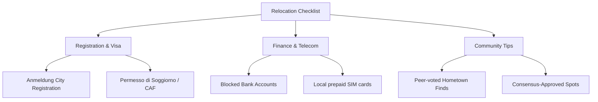

# 🌐 ConnectAbroad


ConnectAbroad is a high-end, responsive peer connection platform built for international students relocating to new countries. Designed with a warm terracotta-cream archival aesthetic, it removes relocation friction by matching students for language practice, academic cohorts, local marketplace trades, consensus-approved guides, and local hangouts.

---

## 🚀 Key Features

* **Widescreen & Responsive Navigation**: Sleek, mobile-first design with bottom navigation scaling down for touch devices, and clean desktop header underlines fitting displays up to `1300px` wide.
* **Persistent Notifications**: A real-time community update center backed by local storage persistence.
* **Peer Directory (Discover)**: Minimalist cards that expand into detailed overlays with direct WhatsApp/Instagram icebreaker launchers.
* **Academic Matchmaker**: Grouping algorithms matching classmates by university, course, and interests.
* **Arrival Checklist (Settle In)**: Dynamic checklist guide with relocation tracking metrics and progress bars.
* **Housing & Goods Marketplace**: Classified trade board supporting student rooms, sublets, textbook exchanges, and local sales.
* **Calendar Event Exporters (.ics)**: RSVP tracker allowing events to download straight to Apple or Google Calendar.

---

## 📊 System Architecture & Features

### Peer Matchmaking Hierarchy

| Match Type | Matching Criteria | Primary Action | Target Indicator |
| :--- | :--- | :--- | :--- |
| **Perfect Tandem** | Speaks what you learn & learns what you speak | Instant DM Icebreaker | Overlap Language tags |
| **Classmate Match** | Shares same University + Major | Group Study/Coffee Invite | Buddy badge |
| **University Match**| Shared enrollment institution | Campus meetups | Institution logo |
| **Hometown Buddy** | Shares origin home country | Nostalgia shares / Meals | Country flag badge |

### Relocation Settle Checklist Setup



---

## 🛠 Setup & Installation

### Prerequisite Environment Variables

Create a `.env` file in the project root or configure these variables inside your deployment provider:

```env
VITE_SUPABASE_URL=https://your-supabase-url.supabase.co
VITE_SUPABASE_ANON_KEY=eyJhbGciOiJIUzI1NiIsInR5cCI6IkpXVCJ9...
```

### Installation Steps

1. **Clone the repository**:
   ```bash
   git clone https://github.com/Dhruu04/ConnectAbroad.git
   cd ConnectAbroad
   ```

2. **Install dependencies**:
   ```bash
   npm install
   ```

3. **Start the local server**:
   ```bash
   npm run dev
   ```

4. **Verify production bundler compile**:
   ```bash
   npm run build
   ```

---

## ☁ Deploying to Netlify

This project compiles into a highly optimized client bundle served as a Single Page Application (SPA).

### Build and Deploy Settings

When setting up your repository on Netlify, the following parameters are pre-configured inside `netlify.toml`:

| Setting | Value | Description |
| :--- | :--- | :--- |
| **Build Command** | `npm run build` | Compiles routing trees and static asset bundles. |
| **Publish Directory** | `dist/client` | Root folder for serving client-side assets and entry index file. |
| **SPA Redirects** | `/* -> /index.html` | Fallback router mapping to prevent 404s on refresh. |

1. Go to your Netlify Dashboard and click **Add new site** > **Import from Git**.
2. Select your repository `ConnectAbroad`.
3. Add the following **Environment Variables** under site configuration settings:
   - `VITE_SUPABASE_URL`
   - `VITE_SUPABASE_ANON_KEY`
4. Click **Deploy Site**. Netlify will automatically detect `netlify.toml` and launch the server.
